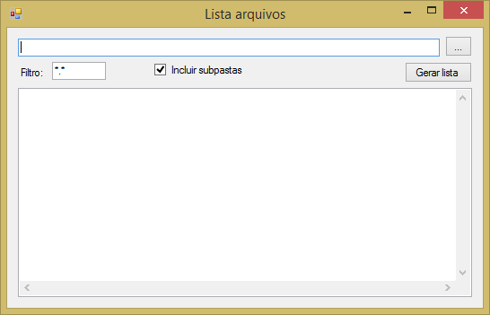

# ListaArquivos
  
Ferramenta simples para listar os arquivos de um diretório desejado.
É possível inserir filtros e também abrir a pasta onde o arquivo está, basta clicar com o botão direito do mouse sobre o arquivo e selecionar a opção para abrir o local do arquivo.   

Danke
